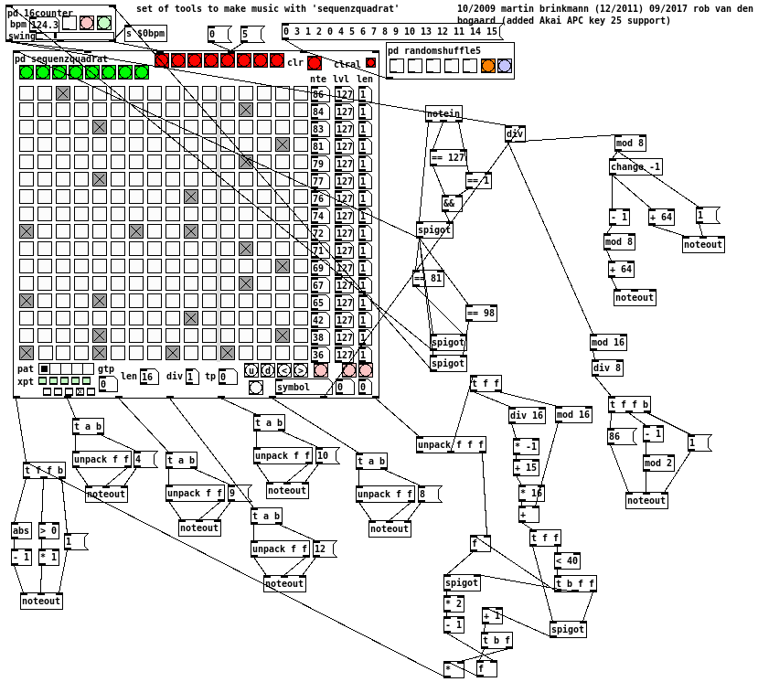
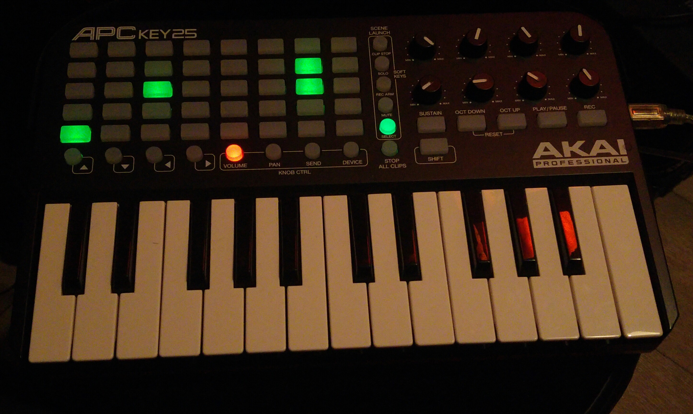

# key25seq

A PureData song sequencer for use with the Akai APC Key25 USB MIDI controller, based on Martin
Brinkmann's "Sequenzquadrat".

Still needs a lot of work to actually be usable as a sequencer of rhythm, bass and chord patterns.

- [X] Start/stop sequencer by pressing PLAY/PAUSE on the Key25
- [X] Step indicator (round buttons below the bottom row of clip trigger buttons, red)
- [X] Indicator of second half of the 16 step pattern (there are 8 physical step position indicators)
- [X] Pattern input - grid check and uncheck (clip trigger buttons, green)
- [X] Pattern send to button leds (pattern is initialised at startup and on pattern select)
- [X] Configure MIDI channel per pattern (currently 5 patterns are available)
- [ ] Clip select mode (pressing SELECT, making its green led flash while in select mode)
- [ ] ..and a lot more

